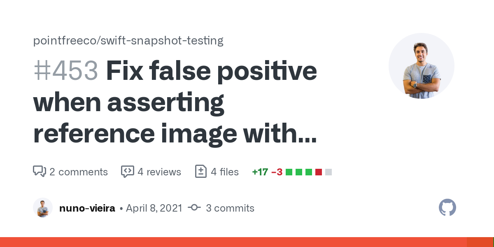

## Hello 👋, I'm Nuno Vieira

<a href="https://www.nunovieira.dev">
  <span>My Website</span>
</a>
<br>
<a href="https://www.linkedin.com/in/nunofcvieira/">
  <span>LinkedIn</span>
</a>
</br>
<a href="https://medium.com/@nuno.vieira">
  <span>Medium<span>
</a>
</br>    
<a href="https://twitter.com/nuno_fcvieira">
  <span>Twitter</span>
</a>
</br>
<a href="https://www.instagram.com/nunovieira.dev/">
  <span>Instagram</span>
</a>

### Tech Stack 🔧

```Swift
struct SoftwareEngineer {
  let name = "Nuno Vieira"
  var languages = ["Swift", "Kotlin", "Typescript", "Ruby", "Elixir", "Go"]
  var frameworks = ["iOS", "React", "Elixir Phoenix", "Kotlin Multiplatform"]
  var databases = ["PostgreSQL", "MySQL", "SQLite", "Realm", "CoreData", "Firebase"]
  var tools = ["Xcode", "VSCode", "IntelliJ IDEA", "iTerm2", "Proxyman", "Fork"]
  var cloud = ["AWS", "Heroku", "Firebase", "GCP"]
}
```

### Open Source Contribution Highlights 💻
<a href="https://github.com/GetStream/stream-chat-swift/pull/2339">
  
</a>
<a href="https://github.com/GetStream/stream-chat-swift/pull/2226">
  
</a>
<a href="https://github.com/kirualex/SwiftyGif/pull/161">
  
</a>
<a href="https://github.com/pointfreeco/swift-snapshot-testing/pull/453">
  
</a>

### Github Tech Stats 📈


### Articles I'm Reading 👨🏻‍🏫

<a href="https://app.daily.dev/NunoVieira">
  
</a>
